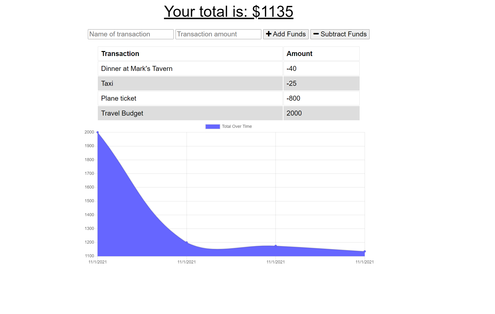

# Budget-Watch
Budget tracking application with offline functionality.

## Table of Contents

1. [Description](#description)

1. [Technologies and Skills](#technologies)

1. [Screenshot](#screenshot)

1. [Link to Deployed App](#sample)

1. [Installation](#installation)

1. [Use](#usage)

1. [License](#license)

1. [Author](#author)

1. [Contact](#contact)

## Description

* This application allows the user to track expenses, online or offline.  The application allows entering of expenses and deposits when offline and updating of those transactions to the tracker when connection is restored.

## Technologies and Skills Demonstrated

* HTML & CSS
* Mongodb
* Express

## Screenshot

## Visit the App deployed on Heroku

* [Link to Deployed Application](https://dry-woodland-30443.herokuapp.com/)

## Installation

* Run the following to install dependancies, the following will be installed, express, mongoose, morgan, compression, lite-server

> npm install

## Usage

* The repo can be forked and then the required modules installed as per above.  The application is run from the command line by entering "node server.js"

## License

- MIT

## Author

* Ben Slinde

## Contact me

* If you would like, you can connect with me thru my github profile [Github Profile](https://github.com/stevenslade)